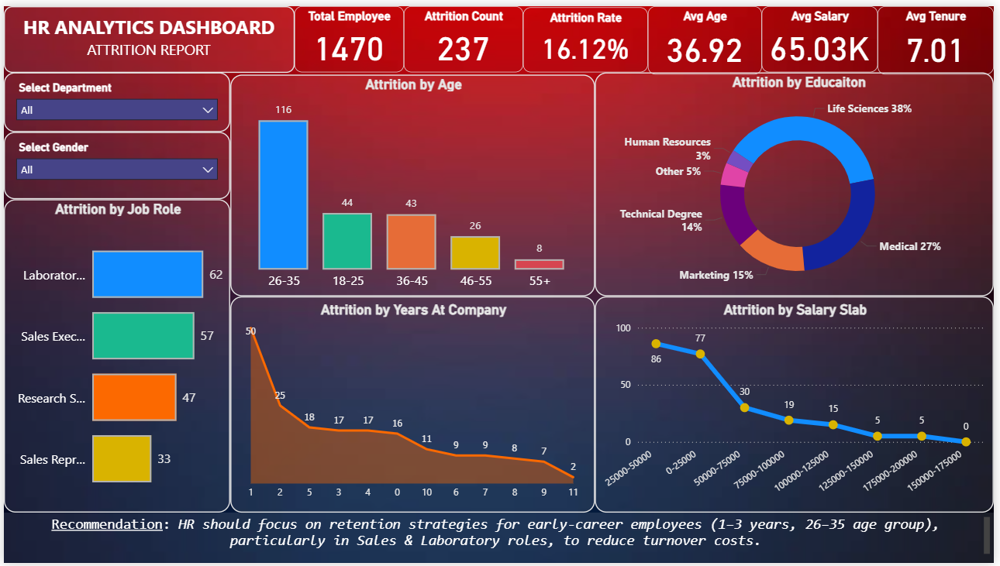

# HR Attrition Analysis Dashboard | Power BI  

## 📌 Project Overview  
This project analyzes HR data of **1,470 employees** to identify key factors driving attrition.  
The dashboard provides insights into **attrition trends by age, job role, education, salary slab, and tenure**, helping HR teams make data-driven decisions.  

## 🛠 Tools Used  
- Power BI Desktop  
- Power Query (Data Cleaning & Transformation)  

## 📊 Key Insights  
- Overall Attrition Rate: **16.1% (237 employees)** 
- Highest attrition in **26–35 age group (49%)**  
- By job role: **Laboratory Technicians (62 exits)** & **Sales Executives (57 exits)**  
- Employees with **1–3 years tenure** and **lower salary slabs (< ₹50K)** showed highest turnover  

## ✅ Recommendation  
Retention strategies should target **early-career employees (1–3 years, 26–35 age group)**, especially in Sales & Lab roles, to reduce turnover costs.  

## 📂 Repository Content  
- `Dashboard_Screenshots/` → Visual previews  
- `HR Dashboard.pbix` → Power BI file  
- `HR Dashboard.pdf` → Dashboard export   
- `README.md` → Project documentation  

## 📸 Dashboard Preview  

---
📌 **Created by:** CHAITANYA SHARMA 
